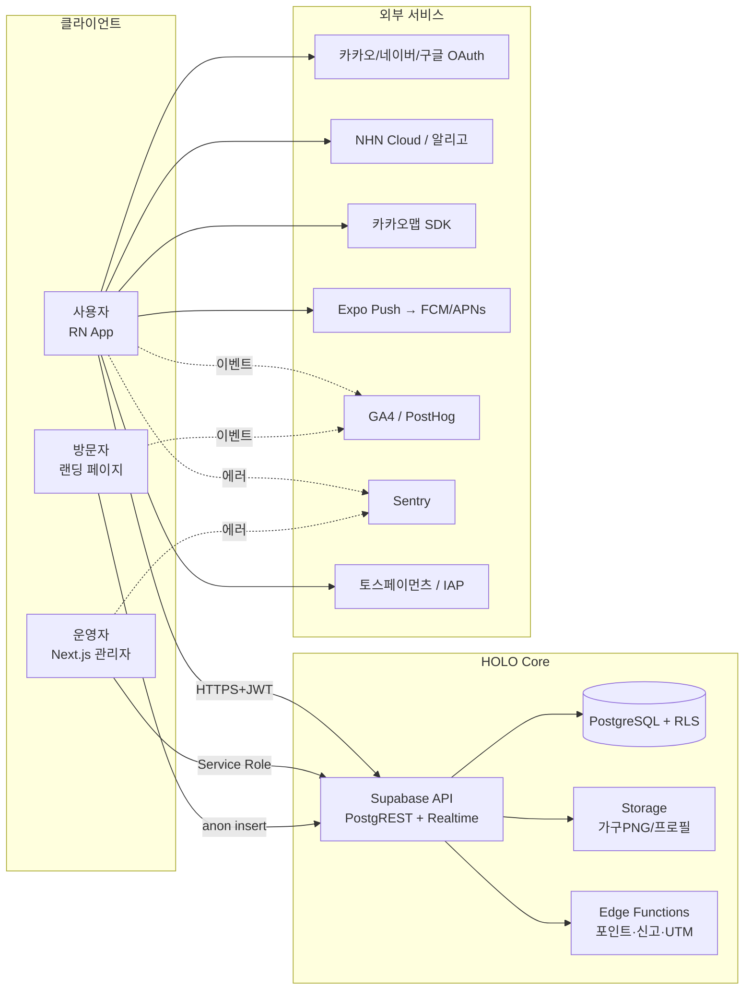
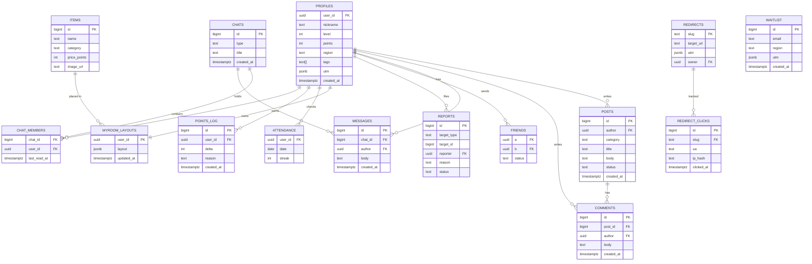
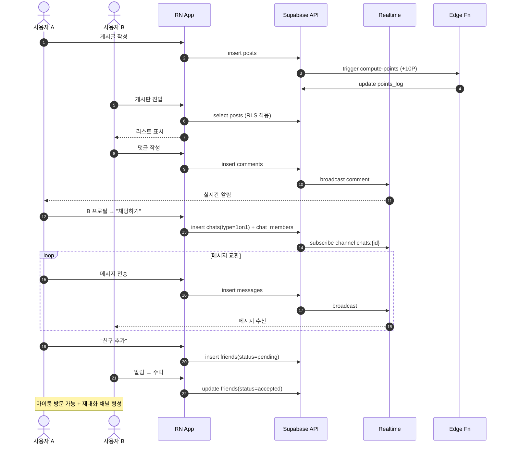
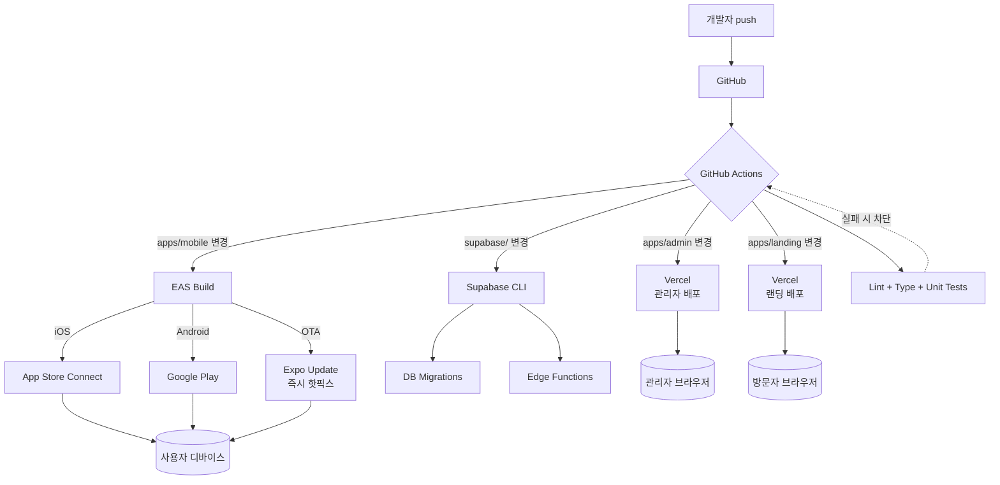
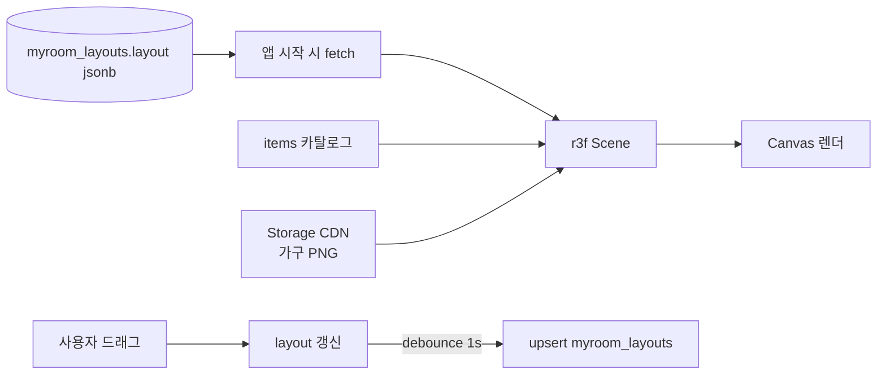

# HOLO 시스템 아키텍처

> Mermaid 다이어그램은 GitHub에서 자동 렌더됩니다.
> 오프라인 열람은 `docs/아키텍처.html` 을 브라우저로 열기.

---

## 1. 시스템 컨텍스트 (Context)

사용자/관리자/외부 서비스/HOLO 핵심 시스템의 경계.



---

## 2. 데이터 모델 (ER)



---

## 3. 게시판 → 채팅 → 친구 전환 시퀀스

핵심 전환 플로우 (서비스 KPI 직결).



---

## 4. 배포 파이프라인 (CI/CD)



---

## 5. 보안 / 권한 레이어

```mermaid
flowchart TB
  subgraph Client[클라이언트]
    Anon[anon key]
    Authed[로그인 JWT]
  end

  subgraph Server[서버 전용]
    SR[Service Role Key]
  end

  subgraph Supabase
    AuthSvc[Auth]
    PostgREST
    RLS{RLS Policy}
    Tables[(Tables)]
  end

  Anon --> AuthSvc
  AuthSvc -->|로그인| Authed
  Authed --> PostgREST
  Anon --> PostgREST
  PostgREST --> RLS
  RLS --> Tables

  SR -. RLS 우회 .-> Tables

  subgraph Policy[정책 매트릭스]
    P1[posts: SELECT public, INSERT auth, UPDATE/DELETE 본인]
    P2[messages: SELECT chat 멤버만, INSERT chat 멤버만]
    P3[friends: SELECT 관계자, UPDATE 관계자]
    P4[reports: INSERT auth, SELECT 관리자]
    P5[waitlist: INSERT anon, SELECT 관리자]
    P6[profiles: SELECT public(공개필드), UPDATE 본인]
  end

  RLS --- Policy
```

**핵심 원칙**
- 클라이언트는 anon key + 로그인 JWT 만 사용
- Service Role Key 는 **서버 컴포넌트 / Edge Function** 에서만
- 모든 테이블 RLS 활성화, 정책 누락 = 접근 불가가 기본
- `waitlist` 만 anon insert 허용, select 는 관리자

---

## 6. 마이룸 렌더 흐름 (보너스)



가구 PNG는 사전 검수된 카탈로그(`items` 테이블)에서만 선택 가능 → 임의 업로드 차단.
